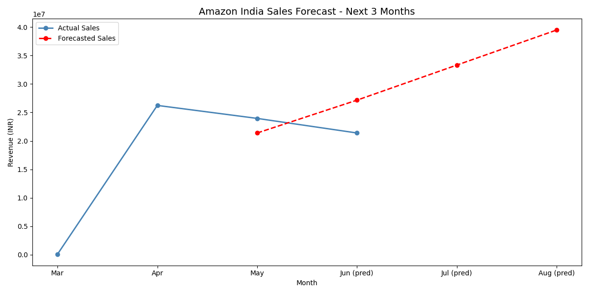
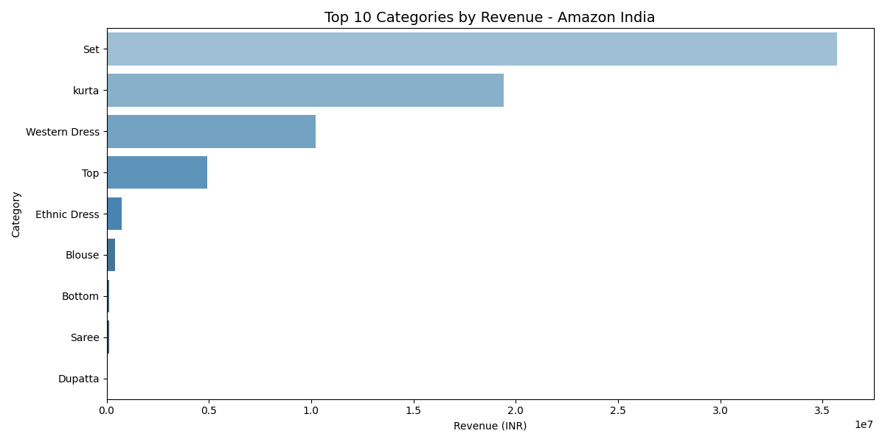
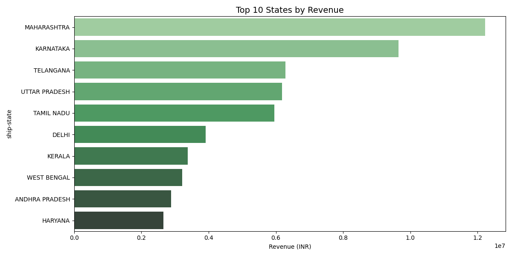

# 📊 Amazon E-Commerce Sales Forecasting with AI

Analyzed 108,071 Amazon India orders and built an AI model to forecast future sales.

## 🚀 Key Results
- 💰 Total Revenue Analyzed: 71,673,394 INR
- 📦 Total Orders: 108,071
- 🏆 Top Category: Set
- 🌍 Top State: Maharashtra
- 📈 AI Forecast: Revenue growing 6M INR/month

## 📈 AI Sales Forecast
| Month | Predicted Revenue |
|-------|------------------|
| June 2022 | 27,159,275 INR |
| July 2022 | 33,319,892 INR |
| August 2022 | 39,480,509 INR |

## 🛠️ Tech Stack
- Python, Pandas, Matplotlib, Seaborn
- Scikit-learn (Linear Regression)
- 128,975 real Amazon transactions

## 📊 Charts

